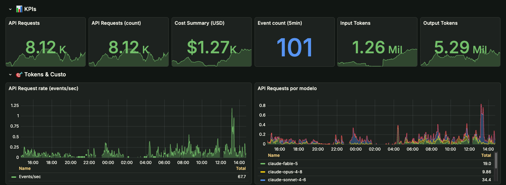
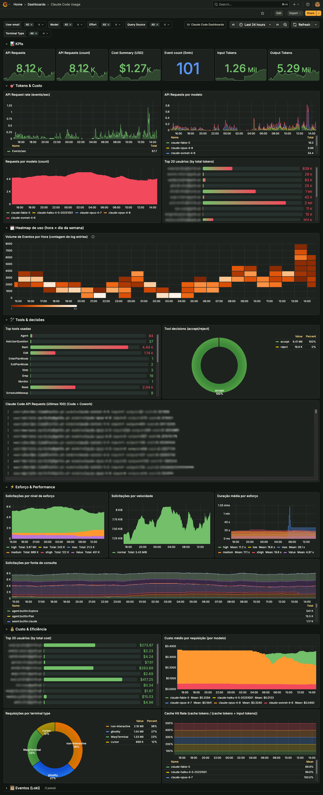

# AI Monitoring Stack (Public Template)

[](./LICENSE)


Public, self-hosted monitoring template for AI tooling usage analysis.

This template focuses on operational observability for tools like Claude Code and Claude Cowork, with a practical business angle: understanding cost versus outcomes.

## What is included

- Grafana (dashboards and analysis)
- Loki (log storage/query)
- Prometheus (metrics and remote write receiver)
- Grafana Alloy (OTLP ingestion and forwarding)
- Example dashboard: `claude-code-usage.json`

## Why this exists

Teams often adopt AI tooling quickly but struggle to answer:

- Which models are driving cost?
- How much input/output token volume are we generating?
- Is cache reducing spend?
- Are tool decisions indicating productive usage?
- Are we improving cost-efficiency over time?

This stack gives a concrete starting point for those questions.

## Quick start

```bash
cd server
cp .env.example .env
docker compose --env-file .env -f docker-compose.yml up -d
```

Then open:

- Grafana: <http://localhost:3000>
- Loki: <http://localhost:3100>
- Prometheus: <http://localhost:9090>
- Alloy UI: <http://localhost:12345>

## Telemetry ingest endpoints

- OTLP gRPC: `localhost:4317`
- OTLP HTTP: `localhost:4318`

Alloy receives both signals on the same endpoint and routes them by type:

- **Logs / events** (for example `claude_code.api_request`, `claude_code.tool_decision`) → **Loki**
- **Metrics** (for example `claude_code.token.usage`, `claude_code.cost.usage`) → **Prometheus** via remote write

The included dashboard `claude-code-usage.json` is **hybrid**:

- **Prometheus** — fast Claude Code KPIs (sessions, cost, tokens, cache, active time)
- **Loki** — org-wide **Code + Cowork** KPIs from OTLP events, plus tools, logs, and drill-down

### Logs vs metrics

Claude Code exports **two OTLP signals**, not one:

| Signal | What it carries | Backend in this stack | Used by example dashboard |
| --- | --- | --- | --- |
| OTLP **logs** | Structured **events** per API call, tool, hook, etc. | Loki | Yes — org KPIs, tools, logs |
| OTLP **metrics** | Aggregated **counters/gauges** (sessions, tokens, cost, active time) | Prometheus | Yes — Claude Code KPIs and trends |

Claude Code sends **both** when `OTEL_METRICS_EXPORTER=otlp` and `OTEL_LOGS_EXPORTER=otlp` are set. Claude Cowork typically exports **events only**, configured in the Anthropic admin console (see below).

**Prometheus empty?** Claude Code defaults to **delta** temporality. Alloy’s `otelcol.exporter.prometheus` drops delta metrics during conversion (no error at default log level). This stack converts delta → cumulative in Alloy via `otelcol.processor.deltatocumulative`. You can still set `OTEL_EXPORTER_OTLP_METRICS_TEMPORALITY_PREFERENCE=cumulative` on the client for belt-and-suspenders reliability.

Official reference: [Claude Code monitoring](https://code.claude.com/docs/en/monitoring-usage).

## Claude Code telemetry configuration

### Per user (local / shell)

Enable OTLP export to this stack:

```bash
export CLAUDE_CODE_ENABLE_TELEMETRY=1
export OTEL_METRICS_EXPORTER=otlp
export OTEL_LOGS_EXPORTER=otlp
export OTEL_EXPORTER_OTLP_PROTOCOL=grpc
export OTEL_EXPORTER_OTLP_ENDPOINT=http://localhost:4317

# Recommended for Prometheus (see "Logs vs metrics" above)
export OTEL_EXPORTER_OTLP_METRICS_TEMPORALITY_PREFERENCE=cumulative

# Optional: faster export while testing (defaults: metrics 60s, logs 5s)
export OTEL_METRIC_EXPORT_INTERVAL=10000
export OTEL_LOGS_EXPORT_INTERVAL=5000

claude
```

Or persist the same variables in `~/.claude/settings.json`:

```json
{
  "env": {
    "CLAUDE_CODE_ENABLE_TELEMETRY": "1",
    "OTEL_METRICS_EXPORTER": "otlp",
    "OTEL_LOGS_EXPORTER": "otlp",
    "OTEL_EXPORTER_OTLP_PROTOCOL": "grpc",
    "OTEL_EXPORTER_OTLP_ENDPOINT": "http://localhost:4317",
    "OTEL_EXPORTER_OTLP_METRICS_TEMPORALITY_PREFERENCE": "cumulative"
  }
}
```

Useful optional variables:

| Variable | Purpose |
| --- | --- |
| `OTEL_EXPORTER_OTLP_HEADERS` | Auth headers for a protected collector (for example `Authorization=Bearer …`) |
| `OTEL_RESOURCE_ATTRIBUTES` | Team/org dimensions on every metric and event (for example `department=platform,team.id=ai`) |
| `OTEL_LOG_USER_PROMPTS` | Include prompt text in events (off by default; privacy-sensitive) |
| `OTEL_LOG_TOOL_DETAILS` | Include tool names, commands, and parameters in events |

### Organization-wide (Claude Code Team / enterprise)

On **Team and enterprise plans**, administrators can push the same OTLP settings to **every user** through **managed settings**. Users cannot override these values locally.

Typical delivery:

1. Admin console or policy pipeline publishes managed settings for the organization.
2. Each machine receives `~/.claude/remote-settings.json` (or equivalent managed settings file).
3. All Claude Code sessions inherit the org collector endpoint, headers, and export toggles.

Example managed settings payload:

```json
{
  "env": {
    "CLAUDE_CODE_ENABLE_TELEMETRY": "1",
    "OTEL_METRICS_EXPORTER": "otlp",
    "OTEL_LOGS_EXPORTER": "otlp",
    "OTEL_EXPORTER_OTLP_PROTOCOL": "grpc",
    "OTEL_EXPORTER_OTLP_ENDPOINT": "https://collector.example.com:4317",
    "OTEL_EXPORTER_OTLP_HEADERS": "Authorization=Bearer example-token",
    "OTEL_EXPORTER_OTLP_METRICS_TEMPORALITY_PREFERENCE": "cumulative",
    "OTEL_RESOURCE_ATTRIBUTES": "organization=acme,environment=production"
  }
}
```

Managed settings can also be distributed via MDM. Point the endpoint at your Alloy ingress (or any OTLP-compatible collector); Alloy in this stack will fan out logs to Loki and metrics to Prometheus as configured.

**Local stack vs org policy:** if `remote-settings.json` already sends telemetry elsewhere, local `settings.json` or shell exports will **not** win. For local-only testing, temporarily disable or rename the managed file, run Claude Code against `localhost:4317`, then restore org settings.

### Claude Cowork (Team / Enterprise)

Cowork does **not** use local `OTEL_*` environment variables. Administrators configure OTLP in **Admin settings → Cowork**:

| Field | Example |
| --- | --- |
| OTLP endpoint | `http://your-collector:4318` |
| OTLP protocol | `http/protobuf` (common) or `grpc` |
| OTLP headers | `Authorization=Bearer …` if needed |

Requirements:

- Cowork desktop app **1.1.4173+**
- If network egress restrictions are enabled, allowlist your collector host in **Admin → Capabilities → Network egress**
- Settings apply to **new Cowork sessions** after save

Point Cowork at the same Alloy instance as Claude Code. Events land in Loki with `service_name=cowork` and appear in the dashboard row **Organização — Code + Cowork (eventos Loki)**.

Reference: [Cowork monitoring](https://claude.com/docs/cowork/monitoring).

## Dashboard preview

Quick visual (great for social preview):



Deep dive (click for full resolution):

<a href="./docs/images/claude-code-usage-full.webp">
  
</a>

If you are sharing this repository on social media, the preview images are:

- `docs/images/claude-code-usage-cover.webp` as the post cover
- `docs/images/claude-code-usage-full.webp` to show detailed widgets and filters

## How to read the dashboard

Two KPI rows at the top serve different scopes:

| Row | Source | Scope |
| --- | --- | --- |
| **Claude Code — métricas (Prometheus)** | OTLP metrics | Claude Code only — fast aggregates |
| **Organização — Code + Cowork (eventos Loki)** | OTLP log events | Combined org view when both products export to Alloy |

Below that, each section title states the product scope and data source:

| Section prefix | Meaning |
| --- | --- |
| **Claude Code · … (Prometheus)** | OTLP metrics from Claude Code only |
| **Code + Cowork · … (Loki)** | OTLP log events from Claude Code and Cowork |

Cowork is configured in the Anthropic admin console; Claude Code via env or managed settings. Both can target the same Alloy endpoint.

## How to read value signals

The dashboard is not a full business KPI system by itself. It provides strong operational evidence (usage, cost, efficiency proxies) that should be interpreted together with product and delivery metrics.

Use this baseline framing:

- cost trend by model/user/team
- token efficiency and cache behavior
- tool decision outcomes as utility proxy
- stable or improving cost per useful outcome over time

## Traces roadmap

This public template starts with logs + metrics.
If trace telemetry is available and useful in your environment, add Tempo in a next phase.
